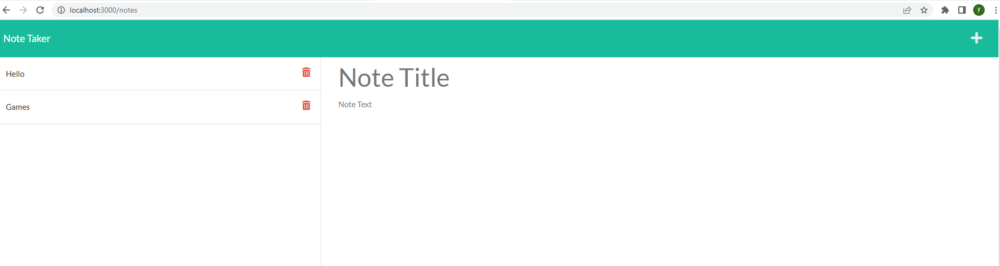

# Note-Taker

This project is an application called Note Taker that can be used to write and save notes. This application uses an Express.js back end and will save and retrieve note data from a JSON file. 

## Criteria

- GIVEN a note-taking application
- WHEN I open the Note Taker
- THEN I am presented with a landing page with a link to a notes page
- WHEN I click on the link to the notes page
- THEN I am presented with a page with existing notes listed in the left-hand column, plus empty fields to enter a new note title and the note’s text in the right-hand column
- WHEN I enter a new note title and the note’s text
- THEN a Save icon appears in the navigation at the top of the page
- WHEN I click on the Save icon
- THEN the new note I have entered is saved and appears in the left-hand column with the other existing notes
- WHEN I click on an existing note in the list in the left-hand column
- THEN that note appears in the right-hand column
- WHEN I click on the Write icon in the navigation at the top of the page
- THEN I am presented with empty fields to enter a new note title and the note’s text in the right-hand column

# How to use it?

- As you run the application press the button "Get started"
- Click on new Title to add your Title
- Click on note text to add your note
- After finishing your note on the top right side of the app click on save button
- If you want to see your saved notes simply click on it
- If you want to delete your saved note click on trash button which is located on the each saved note to remove it.

## Built With
- HTML
- CSS
- Bootstrap 
- JavaScript
- Node.js
  - Express.js
  - Uniqid

  ## Screen shots

  

